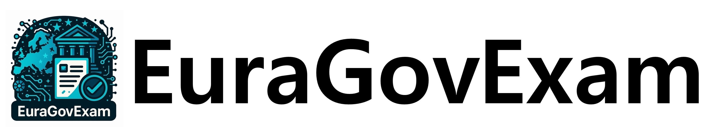

<div align="center">
  
</div>

<p align="center">
  <b>A Multilingual Multimodal Benchmark from Real‑World Civil Service Exams</b>
  <br>
</p>

<h4 align="center">
  <a href="" target="_blank">Paper (Comming Soon!)</a> |
  <a href="https://euragovexam.github.io/EuraGovExam/index.html" target="_blank">Leaderboard</a> |
  <a href="https://huggingface.co/datasets/EuraGovExam/EuraGovExam" target="_blank">Dataset</a>
</h4>

---

## Table of Contents

* [Overview](#overview)
* [Dataset](#dataset)
* [Quick Start](#quick-start)
* [Benchmark Tasks](#benchmark-tasks)
* [Baselines & Leaderboard](#baselines--leaderboard)
* [Citation](#citation)
* [License](#license)
* [Contributing](#contributing)
* [Contact](#contact)

## Overview

EuraGovExam is a high‑fidelity **multilingual** & **multimodal** benchmark built from authentic civil‑service examinations spanning **five Eurasian regions** and **17 academic / bureaucratic domains**. Each problem is provided as a single high‑resolution **image** plus four answer choices, requiring models to reason over layout, tables, diagrams and code‑switched text without additional prompts.

* **Scale:** ≈8 k scanned MCQ items
* **Languages:** Korean, Japanese, Traditional Chinese, English, Hindi
* **Domains:** Mathematics, Law, Administration, Biology, Chemistry, ... (full list below)
* **Regions:** South Korea, Japan, Taiwan, India, European Union

EuraGovExam fills the gap between synthetic academic QA sets and the messy reality of government documents, supporting research on vision‑language models, layout understanding, cross‑lingual reasoning, and instruction following.

## Dataset


### Domains

| #  | Domain           | Share |
| -- | ---------------- | ----- |
| 1  | Mathematics      | 13.0% |
| 2  | Administration   | 11.6% |
| 3  | Biology          | 11.3% |
| 4  | Law              | 10.2% |
| 5  | Language         | 9.3%  |
| 6  | Engineering      | 8.6%  |
| 7  | Physics          | 6.8%  |
| 8  | Economics        | 5.8%  |
| 9  | Computer Science | 5.5%  |
| 10 | History          | 3.2%  |
| 11 | Medicine         | 3.0%  |
| 12 | Politics         | 2.6%  |
| 13 | Chemistry        | 2.6%  |
| 14 | Geography        | 2.3%  |
| 15 | Philosophy       | 1.6%  |
| 16 | Psychology       | 1.5%  |
| 17 | Earth Science    | 1.5%  |

### Download via 🤗 datasets

```python
from datasets import load_dataset
ds = load_dataset("EuraGovExam/EuraGovExam")
```


## Baselines & Leaderboard

See the **public leaderboard** for up‑to‑date results. Key snapshot (July 2025):

| Model                      | Params | Accuracy    |
| -------------------------- | ------ | ----------- |
| **Closed-source Models**   |        |             |
| Gemini-2.5-pro             | —      | **86.99 %** |
| o3                         | —      | 84.26 %     |
| o4-mini                    | —      | 79.40 %     |
| Gemini-2.5-flash           | —      | 68.33 %     |
| Claude-Sonnet-4            | —      | 63.29 %     |
| GPT-4.1-mini               | —      | 56.27 %     |
| GPT-4.1                    | —      | 54.73 %     |
| GPT-4o                     | —      | 42.04 %     |
| Gemini-2.5-flash-lite      | —      | 25.94 %     |
| **Open-source Models**     |        |             |
| Qwen2-VL-72B-Instruct      | 72 B   | 44.65 %     |
| InternVL2.5-38B-MPO        | 38 B   | 39.34 %     |
| Ovis2-32B                  | 32 B   | 35.50 %     |
| Ovis2-16B                  | 16 B   | 32.73 %     |
| Qwen2.5-VL-7B-Instruct     | 7 B    | 32.30 %     |
| Qwen2-VL-7B-Instruct       | 7 B    | 31.38 %     |
| Ovis2-8B                   | 8 B    | 28.31 %     |
| Qwen2-VL-2B-Instruct       | 2 B    | 25.54 %     |
| Phi-3.5-vision-instruct    | 4 B    | 15.67 %     |
| Llama-3.2-11B-Vision       | 11 B   | 12.75 %     |
| llava-1.5-13b              | 13 B   | 18.99 %     |
| llava-1.5-7b               | 7 B    | 14.49 %     |
| llama3-llava-next-8b       | 8 B    | 14.28 %     |
| LLaVA-NeXT-Video-7B-DPO-hf | 7 B    | 13.63 %     |

More details in [`/data/leaderboard.json`](/data/leaderboard.json).

## Citation

If you use EuraGovExam, please cite:

```bibtex
@inproceedings{euragovexam2026,
  title     = {EuraGovExam: A Multilingual Multimodal Benchmark from Real‑World Civil Service Exams},
  author    = {First Author and Second Author and others},
  booktitle = {Proceedings of the AAAI Conference on Artificial Intelligence},
  year      = {2026}
}
```

## License

EuraGovExam is released under the **CC BY‑NC 4.0** license. See [`LICENSE`](LICENSE) for details.

## Contributing

Pull requests are welcome! Please read [`CONTRIBUTING.md`](CONTRIBUTING.md) first and be mindful of regional examination copyright.

## Contact

**Comming Soon!**

