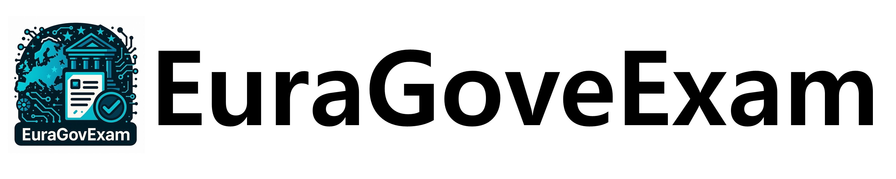

<div align="center">
  
</div>

<p align="center">
  <b>A Multilingual Multimodal Benchmark from Real‑World Civil Service Exams</b>
  <br>
</p>

<h4 align="center">
  <a href="https://arxiv.org/abs/XXXX.XXXXX" target="_blank">Paper</a> |
  <a href="https://euragovexam.github.io/EuraGovExam/index.html" target="_blank">Leaderboard</a> |
  <a href="https://huggingface.co/datasets/EuraGovExam/EuraGovExam" target="_blank">Dataset</a>
</h4>

---

## Table of Contents

* [Overview](#overview)
* [Dataset](#dataset)
* [Quick Start](#quick-start)
* [Benchmark Tasks](#benchmark-tasks)
* [Baselines & Leaderboard](#baselines--leaderboard)
* [Citation](#citation)
* [License](#license)
* [Contributing](#contributing)
* [Contact](#contact)

## Overview

EuraGovExam is a high‑fidelity **multilingual** & **multimodal** benchmark built from authentic civil‑service examinations spanning **five Eurasian regions** and **17 academic / bureaucratic domains**. Each problem is provided as a single high‑resolution **image** plus four answer choices, requiring models to reason over layout, tables, diagrams and code‑switched text without additional prompts.

* **Scale:** ≈8 k scanned MCQ items
* **Languages:** Korean, Japanese, Traditional Chinese, English, Hindi
* **Domains:** Mathematics, Law, Administration, Biology, Chemistry, ... (full list below)
* **Regions:** South Korea, Japan, Taiwan, India, European Union

EuraGovExam fills the gap between synthetic academic QA sets and the messy reality of government documents, supporting research on vision‑language models, layout understanding, cross‑lingual reasoning, and instruction following.

## Dataset

### Directory Structure

```
EuraGovExam/
├── images/                # 8 k+ question images (.png)
├── metadata.jsonl         # per‑item fields (id, domain, region, correct_answer, ocr_text, etc.)
└── README.md
```

### Domains

| #  | Domain         | Share |
| -- | -------------- | ----- |
| 1  | Mathematics    | 11 %  |
| 2  | Administration | 11 %  |
| 3  | Biology        | 11 %  |
| …  | …              | …     |
| 17 | Earth Science  | 4 %   |

### Download via 🤗 datasets

```python
from datasets import load_dataset
ds = load_dataset("EuraGovExam/EuraGovExam", split="test")  # 'train' & 'dev' coming soon
print(ds[0])
```

Each row contains:

| field     | type       | description                           |
| --------- | ---------- | ------------------------------------- |
| `image`   | PIL.Image  | Question sheet (RGB, \~600×400 px)    |
| `choices` | List\[str] | Four multiple‑choice options          |
| `answer`  | str        | Ground‑truth letter `"A"`–`"D"`       |
| `domain`  | str        | Academic / bureaucratic topic         |
| `region`  | str        | Source country                        |
| `ocr`     | str        | (Optional) OCR string for convenience |

## Quick Start

Evaluate any VLM with a *single‑image, single‑choice* interface:

```python
import torch
from PIL import Image
from datasets import load_dataset
from my_vlm import generate_answer  # your model

ds = load_dataset("EuraGovExam/EuraGovExam", split="test")
correct = 0
for item in ds:
    pred = generate_answer(Image.open(item["image"]), item["choices"])
    if pred.upper() == item["answer"]:
        correct += 1
print(f"Accuracy: {correct/len(ds):.2%}")
```

## Benchmark Tasks

EuraGovExam challenges models on:

| Challenge                   | Example                                                         |
| --------------------------- | --------------------------------------------------------------- |
| **Layout parsing**          | Nested tables, multi‑column text                                |
| **Cross‑lingual reasoning** | Korean question referencing English labels                      |
| **Math & numeracy**         | Compute values from visual equations                            |
| **Instruction following**   | Required format *“The answer is X.”* embedded only in the image |

A detailed task taxonomy is in the [paper](https://arxiv.org/abs/XXXX.XXXXX).

## Baselines & Leaderboard

See the **public leaderboard** for up‑to‑date results. Key snapshot (July 2025):

| Model              | Params | Accuracy   |
| ------------------ | ------ | ---------- |
| GPT‑4.1            | —      | **54.7 %** |
| GPT‑4o             | —      | 42.0 %     |
| Claude‑Sonnet‑4    | —      | 46.8 %     |
| Llama‑3‑Vision‑11B | 11 B   | 10.6 %     |
| Gemma‑3‑32B‑it     | 32 B   | 19.4 %     |

More details in [`docs/results.md`](docs/results.md).

## Citation

If you use EuraGovExam, please cite:

```bibtex
@inproceedings{euragovexam2026,
  title     = {EuraGovExam: A Multilingual Multimodal Benchmark from Real‑World Civil Service Exams},
  author    = {First Author and Second Author and others},
  booktitle = {Proceedings of the AAAI Conference on Artificial Intelligence},
  year      = {2026}
}
```

## License

EuraGovExam is released under the **CC BY‑NC 4.0** license. See [`LICENSE`](LICENSE) for details.

## Contributing

Pull requests are welcome! Please read [`CONTRIBUTING.md`](CONTRIBUTING.md) first and be mindful of regional examination copyright.

## Contact

Questions? Create an issue or reach out to **kjsqp1010@semyung.ac.kr**.

